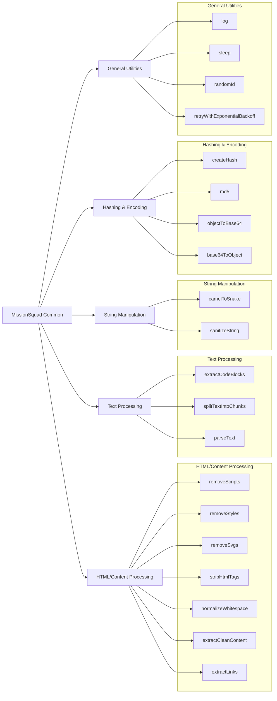

# @missionsquad/common

[](https://www.npmjs.com/package/@missionsquad/common)
[](https://github.com/missionsquad/common/blob/main/LICENSE)

MissionSquad commonly used utilities and types - a collection of TypeScript utilities for HTML processing, text manipulation, hashing, encoding, and general-purpose functions.



## Installation

Install the package using npm or yarn:

```bash
npm install @missionsquad/common
# or
yarn add @missionsquad/common
```

## Usage

Import the functions you need:

```typescript
import { 
  log, 
  sleep, 
  randomId, 
  extractCleanContent 
} from '@missionsquad/common';

// Use the functions
log({ level: 'info', msg: 'Starting process' });

// Async/await example
async function process() {
  await sleep(1000); // Wait for 1 second
  const id = randomId(); // Generate a unique ID
  console.log(`Process ${id} completed`);
}
```

## API Documentation

### HTML/Content Processing

#### `removeScripts(html: string): string`

Removes all script tags and their contents from HTML.

```typescript
import { removeScripts } from '@missionsquad/common';

const cleanHtml = removeScripts('<div>Content</div><script>alert("hello")</script>');
// Result: '<div>Content</div>'
```

#### `removeStyles(html: string): string`

Removes all style tags and their contents from HTML.

```typescript
import { removeStyles } from '@missionsquad/common';

const cleanHtml = removeStyles('<div>Content</div><style>.class { color: red; }</style>');
// Result: '<div>Content</div>'
```

#### `removeSvgs(html: string): string`

Removes all SVG elements from HTML.

```typescript
import { removeSvgs } from '@missionsquad/common';

const cleanHtml = removeSvgs('<div>Content</div><svg><circle cx="50" cy="50" r="40"/></svg>');
// Result: '<div>Content</div>'
```

#### `stripHtmlTags(html: string): string`

Removes all HTML tags from text.

```typescript
import { stripHtmlTags } from '@missionsquad/common';

const plainText = stripHtmlTags('<div>Content <b>with formatting</b></div>');
// Result: 'Content with formatting'
```

#### `normalizeWhitespace(input: string): string`

Normalizes whitespace and newlines in text.

```typescript
import { normalizeWhitespace } from '@missionsquad/common';

const normalized = normalizeWhitespace('Text  with    multiple    spaces\n\n\nand newlines');
// Result: 'Text with multiple spaces\n and newlines'
```

#### `extractLinks(html: string): string[]`

Extracts links from HTML content, filtering out common tracking and utility links.

```typescript
import { extractLinks } from '@missionsquad/common';

const links = extractLinks('<a href="https://example.com">Link</a><a href="https://google.com">Google</a>');
// Result: ['https://example.com']
```

#### `extractCleanContent(html: string): Promise<Content>`

Extracts and cleans the main content from HTML, returning an object with text, links, and images.

```typescript
import { extractCleanContent } from '@missionsquad/common';

async function processHtml() {
  const content = await extractCleanContent('<div>Main content </div>');
  console.log(content.text); // 'Main content'
  console.log(content.images); // ['image.jpg']
}
```

### Text Processing

#### `extractCodeBlocks(text: string, patterns: { start: string; stop: string }[]): string[]`

Extracts code blocks from text based on provided patterns.

```typescript
import { extractCodeBlocks } from '@missionsquad/common';

const text = 'Some text\n```\ncode block\n```\nMore text';
const patterns = [{ start: '```', stop: '```' }];
const blocks = extractCodeBlocks(text, patterns);
// Result: ['code block']
```

#### `splitTextIntoChunks(text: string, pattern: { start: string; stop: string }): { text: string; code: boolean; language?: string }[]`

Splits text into chunks of code and non-code blocks based on a given pattern.

```typescript
import { splitTextIntoChunks } from '@missionsquad/common';

const text = 'Some text\n```javascript\nconst x = 5;\n```\nMore text';
const pattern = { start: '```', stop: '```' };
const chunks = splitTextIntoChunks(text, pattern);
// Result: [
//   { text: 'Some text\n', code: false },
//   { text: 'const x = 5;', code: true, language: 'javascript' },
//   { text: '\nMore text', code: false }
// ]
```

#### `parseText(text: string): { code: boolean; text: string; language?: string }[]`

Parses text into chunks based on predefined patterns, identifying code blocks.

```typescript
import { parseText } from '@missionsquad/common';

const text = 'Some text\n```javascript\nconst x = 5;\n```\nMore text';
const parsed = parseText(text);
// Result: [
//   { text: 'Some text\n', code: false },
//   { text: 'const x = 5;', code: true, language: 'javascript' },
//   { text: '\nMore text', code: false }
// ]
```

### String Manipulation

#### `camelToSnake(camelCase: string): string`

Converts a camelCase string to snake_case.

```typescript
import { camelToSnake } from '@missionsquad/common';

const snakeCase = camelToSnake('thisIsCamelCase');
// Result: 'this_is_camel_case'
```

#### `sanitizeString(input: string): string`

Sanitizes a string by replacing all non-alphanumeric characters, underscores, hyphens, and dots with a hyphen.

```typescript
import { sanitizeString } from '@missionsquad/common';

const sanitized = sanitizeString('file name with spaces!@#');
// Result: 'file-name-with-spaces---'
```

### Hashing & Encoding

#### `createHash(data: Object | string): Promise<string>`

Creates a SHA-1 hash from the provided data.

```typescript
import { createHash } from '@missionsquad/common';

async function hashData() {
  const hash = await createHash('data to hash');
  console.log(hash); // SHA-1 hash as a hex string
}
```

#### `md5(data: Object | string): string`

Generates an MD5 hash from the provided data.

```typescript
import { md5 } from '@missionsquad/common';

const hash = md5('data to hash');
console.log(hash); // MD5 hash as a hex string
```

#### `objectToBase64(input: Object): string`

Converts an object to a base64-encoded string.

```typescript
import { objectToBase64 } from '@missionsquad/common';

const encoded = objectToBase64({ key: 'value' });
// Result: 'eyJrZXkiOiJ2YWx1ZSJ9'
```

#### `base64ToObject<T>(base64: string): T`

Converts a base64-encoded string to an object of type T.

```typescript
import { base64ToObject } from '@missionsquad/common';

interface MyData {
  key: string;
}

const decoded = base64ToObject<MyData>('eyJrZXkiOiJ2YWx1ZSJ9');
// Result: { key: 'value' }
```

### General Utilities

#### `log({ level, msg, error }: { level: string, msg: string, error?: any }): void`

Logs a message to the console with a specified log level and optional error.

```typescript
import { log } from '@missionsquad/common';

log({ level: 'info', msg: 'Operation successful' });
log({ level: 'error', msg: 'Operation failed', error: new Error('Something went wrong') });
```

#### `sleep(ms: number): Promise<void>`

Pauses execution for a specified amount of time.

```typescript
import { sleep } from '@missionsquad/common';

async function delayedOperation() {
  console.log('Starting');
  await sleep(1000); // Wait for 1 second
  console.log('Continuing after delay');
}
```

#### `randomId(length: number = 21): string`

Generates a random ID using nanoid, with a default length of 21 characters.

```typescript
import { randomId } from '@missionsquad/common';

const id = randomId(); // Default length (21)
const shortId = randomId(10); // Custom length
```

#### `retryWithExponentialBackoff(fn: (...args: any) => Promise<any>, onRetry: () => any = () => null, maxAttempts: number = 5, baseDelayMs: number = 500): Promise<any>`

Retries a function with exponential backoff in case of failure.

```typescript
import { retryWithExponentialBackoff } from '@missionsquad/common';

async function fetchWithRetry(url: string) {
  return retryWithExponentialBackoff(
    async () => {
      const response = await fetch(url);
      if (!response.ok) throw new Error(`HTTP error ${response.status}`);
      return response.json();
    },
    () => console.log('Retrying fetch...'),
    3, // Max attempts
    1000 // Base delay in ms
  );
}
```

## Types

### `LogLevel`

```typescript
type LogLevel = 'debug' | 'info' | 'warn' | 'error'
```

### `Content`

```typescript
interface Content {
  text: string
  links?: string[]
  images?: string[]
}
```

## License

This project is licensed under the Apache-2.0 License - see the LICENSE file for details.

## Contributing

Contributions are welcome! Please feel free to submit a Pull Request.

1. Fork the repository
2. Create your feature branch (`git checkout -b feature/amazing-feature`)
3. Commit your changes (`git commit -m 'Add some amazing feature'`)
4. Push to the branch (`git push origin feature/amazing-feature`)
5. Open a Pull Request

## Development

```bash
# Install dependencies
yarn

# Build the package
yarn build

# Run tests
yarn test

# Format code
yarn format
